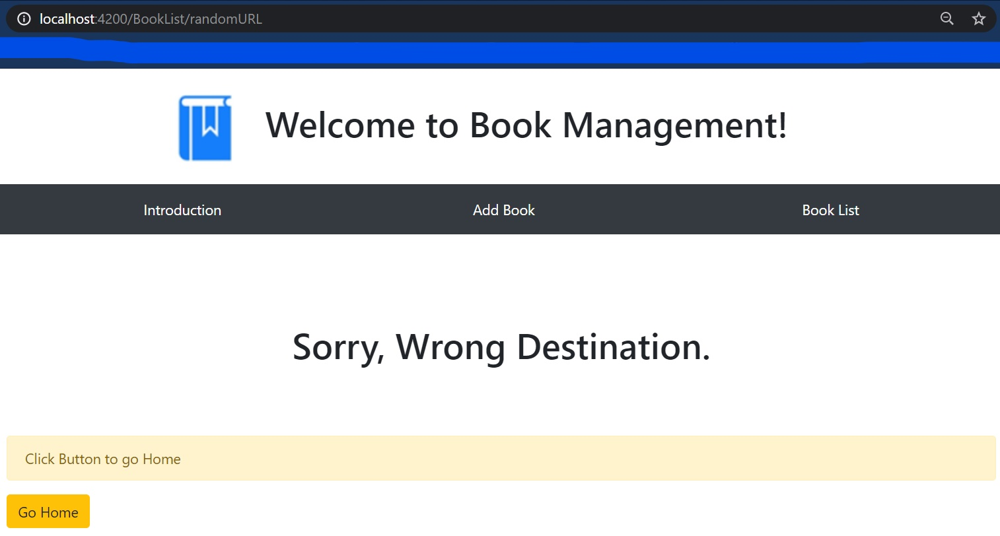

# Angular FrontEnd Book App V2

This App is to demonstrate the live view updation on the state change event, such as a book is added to the list. This tiny app also shows, how to route unspecified routes to a 404 page.

## Introduction page

## Add Book Form

## Initial List of Books

## Adding New Book

## Updated List

## Error 404 Page

